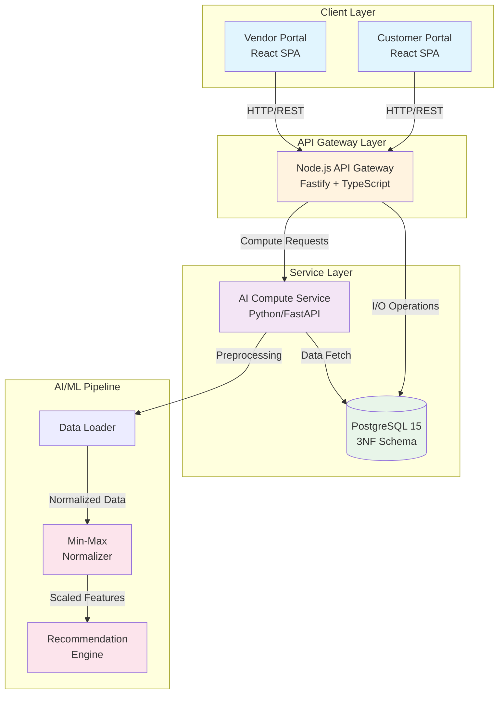
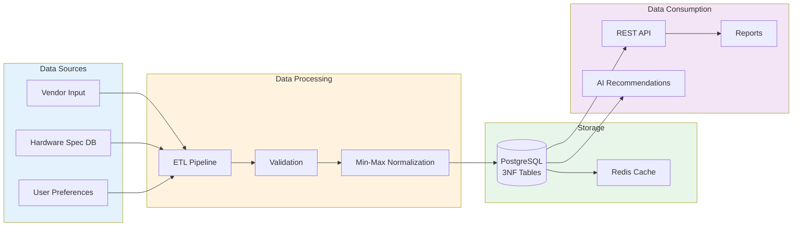

# AI Powered Laptop Recommendation and Marketplace for Gulhaji Plaza

**BSCS Final Year Project**

A full-stack monorepo implementing an AI-powered laptop recommendation system and marketplace for Gulhaji Plaza, Peshawar.

## 🏗️ System Architecture

### Figure 1: System Architecture



## 📁 Project Structure

```
finalYearProject/
├── docker-compose.yml          # WSL2-optimized orchestration
├── data/
│   └── sql/
│       └── 001_initial_schema.sql   # 3NF database schema
├── services/
│   ├── frontend/               # React SPA (Vite + Tailwind + Shadcn)
│   │   ├── src/
│   │   │   ├── layouts/        # Customer & Vendor layouts
│   │   │   ├── pages/          # Portal pages
│   │   │   └── components/ui/  # Shadcn components
│   │   └── Dockerfile
│   ├── api-gateway/            # Node.js API Gateway
│   │   ├── src/
│   │   │   ├── routes/         # REST endpoints
│   │   │   └── db/             # Database connection
│   │   └── Dockerfile
│   └── ai-compute/             # Python AI Service
│       ├── preprocessing/
│       │   ├── normalizer.py   # Min-Max Normalization
│       │   └── data_loader.py  # Data loading utilities
│       └── Dockerfile
└── docs/                       # Documentation
```

## 🚀 Quick Start

### Prerequisites

- Docker & Docker Compose (WSL2 backend recommended)
- Node.js 18+ (for local development)
- Python 3.11+ (for local development)

### Running with Docker Compose

```bash
# Start all services
docker-compose up -d

# View logs
docker-compose logs -f

# Stop all services
docker-compose down
```

### Access Points

| Service | URL | Description |
|---------|-----|-------------|
| Frontend (Customer) | http://localhost:5173 | Laptop discovery & recommendations |
| Frontend (Vendor) | http://localhost:5173/vendor | Inventory management |
| API Gateway | http://localhost:3000 | REST API |
| API Docs | http://localhost:3000/docs | Swagger UI |
| AI Compute | http://localhost:8000 | ML service |
| PostgreSQL | localhost:5432 | Database |

## 🗄️ Database Schema (3NF)

The database follows Third Normal Form (3NF) with ACID compliance:

- **brands**: Master table for laptop manufacturers
- **users**: Customer and vendor accounts
- **hardware_specs**: Normalized specifications (independent of inventory)
- **laptop_models**: Bridge between brands and specs
- **vendors**: Gulhaji Plaza shopkeeper information
- **inventory**: Stock management with ACID constraints
- **recommendations**: AI-generated recommendations
- **user_preferences**: User preference storage

## 🤖 AI Core Features

### Min-Max Normalization

The AI compute service implements Min-Max Normalization for scaling hardware specifications:

```
X_normalized = (X - X_min) / (X_max - X_min)
```

Features normalized:
- Processor cores, threads, clock speeds
- RAM capacity
- Storage capacity
- Display characteristics
- GPU scores
- Portability metrics

## 🎨 Frontend Features

### Customer Portal
- AI-powered laptop recommendations
- Browse and filter laptops
- Compare specifications
- Vendor price comparison

### Vendor Portal
- Inventory dashboard
- Add/edit products
- Stock management
- Low-stock alerts

## 📊 Data Provenance

### Figure 4: Data Flow & Provenance



## 🔧 WSL2 Optimizations

The Docker Compose configuration includes WSL2-specific optimizations:

- **Cached volumes**: Improved I/O performance for bind mounts
- **Polling**: File watching compatibility with WSL2
- **Named volumes**: PostgreSQL data persistence
- **Resource limits**: Prevent memory exhaustion
- **Network configuration**: Optimized subnet for localhost access

## 📝 API Endpoints

### Authentication
- `POST /api/v1/users/register` - Register new user
- `POST /api/v1/users/login` - User login

### Laptops
- `GET /api/v1/laptops` - Browse laptops with filters
- `GET /api/v1/laptops/:id` - Get laptop details
- `GET /api/v1/laptops/search/:query` - Search laptops

### Recommendations
- `POST /api/v1/recommendations` - Get AI recommendations
- `GET /api/v1/recommendations/trending` - Trending laptops
- `GET /api/v1/recommendations/by-usage/:usage` - Filter by usage

### Inventory (Vendor)
- `GET /api/v1/inventory` - Get all inventory
- `POST /api/v1/inventory` - Add inventory item
- `PUT /api/v1/inventory/:id` - Update inventory
- `PATCH /api/v1/inventory/:id/stock` - Update stock

## 🛠️ Development

### Frontend Development

```bash
cd services/frontend
npm install
npm run dev
```

### API Gateway Development

```bash
cd services/api-gateway
npm install
npm run dev
```

### AI Compute Development

```bash
cd services/ai-compute
pip install -r requirements.txt
python -m uvicorn main:app --reload
```

## 📄 License

MIT License - BSCS Final Year Project

## 👥 Team

AI Powered Laptop Recommendation and Marketplace for Gulhaji Plaza
